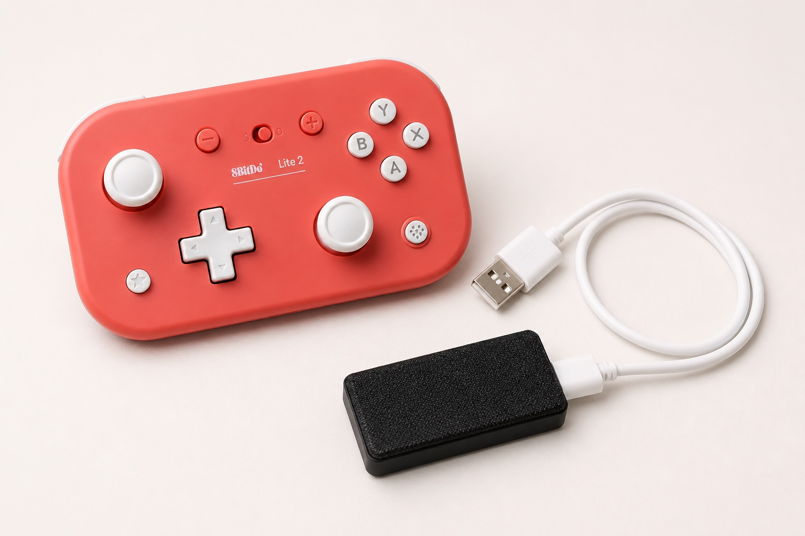

# Red Monkey MPG

<p align="center">
  
</p>

Red Monkey MPG is an experimental, source-available wireless CNC jog-pendant
bridge. A Raspberry Pi Pico 2 W runs one of two receiver firmware images:

- a **gamepad receiver** for a supported Bluetooth controller; or
- an **iPhone receiver** for the Red Monkey MPG iOS app.

Both variants present the Pico to the CNC controller as a USB keyboard and
enforce the same fixed motion-safety rules. Install exactly one firmware image
at a time.

<p align="center">
  
</p>

> **Release status:** `0.4.0-rc.3` is a hardened release candidate,
> not an approved commercial image. The prototype has completed Mac keyboard
> and machine testing with the first CNC controller profile using both the
> gamepad and iPhone receiver paths.
> Red Monkey MPG is not a
> safety-rated control and never replaces a hard-wired E-stop or normal machine
> safeguards. See [Production readiness](docs/PRODUCTION_READINESS.md).

## Intended hardware

- Raspberry Pi Pico 2 W (RP2350 + CYW43439 wireless controller)
- One wireless input: a supported Bluetooth gamepad or an iPhone running the
  [Red Monkey MPG app](https://github.com/red-monkey-makers/red-monkey-cnc-jogger)
- Data-capable **Micro-USB** cable to the CNC controller's USB keyboard port
- A physical, hard-wired emergency stop independent of Red Monkey MPG

The Pico 2 W has a Micro-USB connector. The cable both
powers the Pico and carries USB HID keyboard reports to the CNC controller.

## End-user guides

- [Choose a firmware image](docs/FIRMWARE_VARIANTS.md) — compare the gamepad
  and iPhone receiver variants and download the correct UF2.
- [Firmware installation and updates](docs/FIRMWARE_INSTALLATION.md) — download,
  verify, install, recover, and validate an official UF2 release on macOS or
  Windows.
- [Gamepad + MASSO end-user guide](docs/MASSO_END_USER_GUIDE.md) — startup,
  controls, daily operation, safety checks, and troubleshooting for the
  gamepad receiver.
- [iPhone + MASSO end-user guide](docs/IPHONE_END_USER_GUIDE.md) — connect the
  app, choose step or continuous motion, jog, reconnect, and troubleshoot.
- [Mobile BLE bench test](docs/MOBILE_BLE_BENCH_TEST.md) — safely exercise the
  Red Monkey MPG iOS app with a diagnostic UF2 that cannot emit CNC
  keyboard commands.
- [iPhone receiver MASSO test](docs/MOBILE_RECEIVER_MASSO_TEST.md) — staged
  computer, motion-disabled, and minimum-speed qualification for the mobile
  production receiver candidate.

## Design

```text
Bluetooth gamepad ----> gamepad receiver UF2 --+
                                                 +--> safety mapper
Red Monkey MPG app ---> iPhone receiver UF2 ---+          |
                                                   CNC output profile
                                                          |
                                                   USB HID keyboard
```

The portable mapping core is isolated from the Bluetooth and USB transports.
This makes its safety behavior testable on a desktop before hardware is used.
See [firmware variants](docs/FIRMWARE_VARIANTS.md) for the transport split,
[CNC controller profiles](docs/CNC_CONTROLLER_PROFILES.md) for the output
extension contract, and [input-controller profiles](docs/CONTROLLER_PROFILES.md)
for supported gamepad parsing.

## Repository layout

```text
firmware/             Pico firmware and portable control logic
  include/red_monkey_mpg/    Public headers
  src/                Core and hardware adapter skeletons
  tests/              Host-side tests
docs/                 Mapping, safety, architecture, setup, and roadmap
cmake/                 Pico SDK import helper
scripts/               Controlled release and SBOM tooling
```

## Current state

- [x] Control-event model and fail-closed safety state machine
- [x] Default Lite 2 control mapping specification
- [x] Host unit, persistence, protocol, and property/fuzz tests
- [x] Selectable CNC-controller output profile registry and TinyUSB keyboard output
- [x] Bluetooth Classic HID host for the commissioned Lite 2
- [x] Disconnect, stale-input, USB-fault, and neutral-rearm handling
- [x] A-button resolution cycling
- [x] Verify the first CNC profile's shortcuts from controller documentation
- [x] First hardware-in-the-loop motion test
- [x] Configuration protocol v1 specification and browser-app preview
- [x] Portable validation for constrained user mappings
- [x] Composite USB keyboard + CDC production firmware
- [x] Flash-backed controller bonds and atomic configuration persistence
- [x] Watchdog, USB suspend, malformed-report, and setup-session fail-closed paths
- [x] Redundant CRC-checked configuration with readback verification
- [x] Descriptor fingerprint enforcement and reproducible release/SBOM tooling
- [x] Fail-closed controller-profile registry with Lite 2 D-input profile
- [x] Separate iPhone BLE-to-USB receiver candidate with the same fixed safety mapper
- [ ] Production pairing, power-loss, and RF qualification across multiple units
- [ ] Authorized USB VID/PID and signed-boot manufacturing process

See [docs/BUILDING.md](docs/BUILDING.md) to build and test, then read
[docs/SAFETY.md](docs/SAFETY.md) before connecting to a machine.

The separate `red_monkey_mpg_keyboard_bench` image only validates USB enumeration and
the bounded key sequence on a normal computer. It is not machine firmware; see
[docs/USB_KEYBOARD_BENCH_TEST.md](docs/USB_KEYBOARD_BENCH_TEST.md).

The `red_monkey_mpg_live_bridge_bench` image drives those keys from the
commissioned controller but is still Mac-only test firmware. Its mandatory
fault and release checks are in
[docs/LIVE_BRIDGE_BENCH_TEST.md](docs/LIVE_BRIDGE_BENCH_TEST.md).

After all computer-side checks pass, commission the selected CNC controller
profile using its profile-specific guide, with motion physically disabled
before any powered test. The first guide is
[MASSO G3 Touch 5.13 commissioning](docs/MASSO_G3_513_COMMISSIONING.md).

The `red-monkey-mpg-gamepad-receiver-<version>.uf2` release image is the gamepad
receiver. Its build target is `red_monkey_mpg_production_receiver`. It exposes a
fail-closed setup channel over USB serial on Mac/Windows and acts as a USB
keyboard using the selected CNC profile whenever the setup port is closed.
Pairing and mappings persist in redundant, CRC-checked flash records, and every
receiver exposes a USB serial derived from its Pico chip ID. Follow
[docs/PRODUCTION_RECEIVER_TEST.md](docs/PRODUCTION_RECEIVER_TEST.md) before
machine use.

The `red-monkey-mpg-mobile-receiver-<version>.uf2` release image accepts
the Red Monkey MPG iOS app instead of a Bluetooth gamepad. GitHub prereleases
include both variants, but only one image can be installed on a Pico at a time.
Complete the [iPhone receiver MASSO test](docs/MOBILE_RECEIVER_MASSO_TEST.md)
before machine use.

## Principles

1. Release, disconnect, stale input, and faults always stop output.
2. Motion requires a deliberate held input: gamepad dead-man plus direction,
   or an actively held iPhone direction control.
3. Output is limited to one axis at a time; changing axes requires recentering.
4. No wireless device replaces a hard-wired E-stop.
5. Destructive commands (zero, home, start) require explicit confirmation and
   are disabled until the selected CNC profile's shortcuts are verified.

## License

Red Monkey MPG is source-available under the
[PolyForm Shield License 1.0.0](LICENSE). Machine shops and other users may use
the software in their businesses, but the license does not permit using it to
provide a competing product. See [TRADEMARKS.md](TRADEMARKS.md) and
[THIRD_PARTY_NOTICES.md](THIRD_PARTY_NOTICES.md) for additional notices.

Commercial licenses for uses outside the PolyForm Shield grant may be offered
separately by the licensor. This is not an OSI-approved open-source license.
