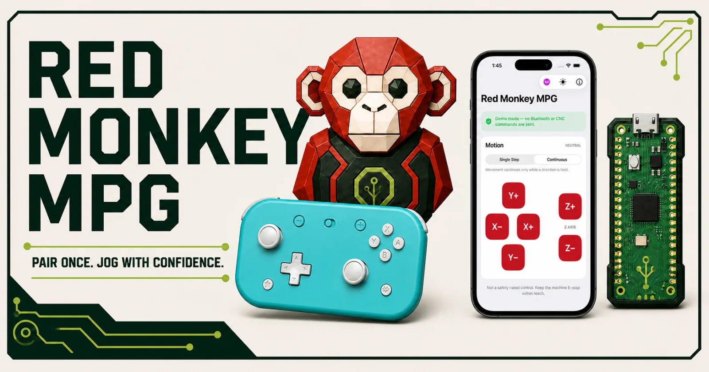

# Install or update Red Monkey MPG firmware

<p align="center">
  
</p>

This guide is for an end user installing an official Red Monkey MPG firmware
release on a Raspberry Pi Pico 2 W receiver. Building source code, installing a
Pico SDK, and opening a serial terminal are not required.

> **Important:** Disconnect the receiver from the CNC controller before
> updating it. Perform the entire installation with the receiver connected
> only to a Mac or Windows computer. Red Monkey MPG is not safety-rated and
> never replaces a hard-wired E-stop or normal machine safeguards.

## What you need

- The Red Monkey MPG receiver
- A Mac or Windows computer
- A data-capable Micro-USB cable
- The official firmware file ending in `.uf2`

Download firmware from the project's
[GitHub Releases page](https://github.com/red-monkey-makers/red-monkey-mpg-firmware/releases).
Under **Assets**, download the receiver variant you intend to use:

```text
red-monkey-mpg-gamepad-receiver-<version>.uf2
red-monkey-mpg-mobile-receiver-<version>.uf2
```

Install exactly one variant. The version will change in later releases. Do not
copy GitHub's automatically generated source-code ZIP or TAR files to the
receiver. Do not install files
named `keyboard_bench`, `hid_dump`, `bt_scan`, `live_bridge_bench`,
`commissioning`, or `preview`; those are development and diagnostic images.

| File | Use it for |
|---|---|
| `red-monkey-mpg-gamepad-receiver-<version>.uf2` | Supported Bluetooth gamepad; currently the 8BitDo Lite 2 in D mode |
| `red-monkey-mpg-mobile-receiver-<version>.uf2` | Red Monkey MPG iPhone app |

See [Choose a receiver firmware image](FIRMWARE_VARIANTS.md) for the full
comparison.

## Optional: verify the download

GitHub displays a SHA-256 digest for each release asset. Verifying it confirms
that the downloaded file matches the published asset.

On macOS, open Terminal and run:

```sh
shasum -a 256 ~/Downloads/red-monkey-mpg-gamepad-receiver-0.4.0-rc.3.uf2
```

On Windows, open PowerShell and run:

```powershell
Get-FileHash "$HOME\Downloads\red-monkey-mpg-gamepad-receiver-0.4.0-rc.3.uf2" -Algorithm SHA256
```

Use the actual downloaded filename. The resulting value must exactly match the
SHA-256 shown in the GitHub release notes. Stop if it does not match.

## Install on macOS or Windows

1. Stop the CNC machine safely and unplug the receiver from the CNC
   controller.
2. Disconnect the receiver's USB cable.
3. Press and hold the receiver's **BOOTSEL** button.
4. While continuing to hold BOOTSEL, connect the receiver to the computer with
   a data-capable Micro-USB cable.
5. Release BOOTSEL when a removable drive named **RPI-RP2** appears:
   - On macOS, find it in Finder under **Locations**.
   - On Windows, find it in File Explorer under **This PC**.
6. Copy the downloaded `.uf2` file onto the **RPI-RP2** drive.
7. Wait. The drive should disappear automatically after the copy finishes.
   This is normal and means the receiver has rebooted into the new firmware.
8. Allow approximately 10 seconds for startup, then unplug the receiver from
   the computer.

Do not press BOOTSEL during an ordinary startup. BOOTSEL is needed only when
installing or recovering firmware.

If the receiver enclosure does not provide safe BOOTSEL access, follow the
supplier's instructions. Do not open or modify a supplied enclosure unless the
supplier specifically instructs you to do so.

## Saved settings after an update

For the gamepad receiver, a normal UF2 installation is designed to preserve the
paired controller and saved mapping in reserved flash sectors outside the
application image. The iPhone receiver does not use the browser configurator or
the gamepad mapping record; its CNC profile is selected in the iPhone app.

Do **not** use a full-chip erase utility or a `flash_nuke.uf2` file. Those can
erase Bluetooth keys and saved configuration. Even after a normal update,
always verify reconnection and the selected CNC profile before returning the
receiver to machine service.

## Reconnect the gamepad receiver

1. Confirm the controller is in its commissioned mode. The supplied 8BitDo
   Lite 2 configuration uses **D mode**.
2. Release L2, R2, and every other button, and center both sticks.
3. Connect the receiver to a computer first if you want to verify its displayed
   firmware version in the configurator.
4. If you open the configurator, confirm the expected firmware version,
   controller, mapping, and CNC profile. Select **Finish & disconnect**, then
   close the setup session before unplugging the receiver. Motion output is
   intentionally locked while setup is connected.
5. Unplug the receiver from the computer and connect it to the CNC controller's
   USB keyboard port.
6. Press the gamepad's **Home** button once. Do not put an already paired
   controller into pairing mode.
7. Keep every control neutral until the receiver LED becomes solid.

If the pairing or mapping is missing, reconnect the receiver to a computer and
use the Red Monkey MPG Configurator to pair and save the intended profile.

## Reconnect the iPhone receiver

1. Confirm you installed `red-monkey-mpg-mobile-receiver-<version>.uf2`.
2. Connect the receiver to a computer for initial keyboard-viewer testing, or
   to the CNC controller only after that testing passes.
3. Open Red Monkey MPG on the iPhone and use the antenna/connection menu.
4. Find and select **Red Monkey MPG**. Accept the iOS pairing prompt if shown.
5. Select the intended CNC controller profile in the app; currently MASSO.
6. Wait for the app to report the receiver ready and show the motion controls.
7. Keep all direction controls released until the connection is ready.

The iPhone image does not appear in the browser configurator and does not
accept a Bluetooth gamepad. Follow the
[iPhone end-user guide](IPHONE_END_USER_GUIDE.md) for daily operation.

## Required post-update safety check

Perform the common checks plus the checklist for the installed variant with
cutting energy disabled, the work area clear, the physical E-stop accessible,
the smallest step size selected, and a very low jog feed.

### Both variants

- [ ] The downloaded filename matches the intended wireless input.
- [ ] Each commanded axis and direction matches the machine display and
      physical movement.
- [ ] Two simultaneous axis commands are never emitted.
- [ ] Wireless disconnect and receiver power loss release movement.
- [ ] Motion remains stopped after reconnect until controls return to neutral.
- [ ] Step-size controls change only the intended displayed CNC setting.

### Gamepad receiver

- [ ] The expected firmware version, controller, mapping, and CNC profile are
      shown by the configurator.
- [ ] The controller reconnects normally without entering pairing mode.
- [ ] The receiver becomes ready only after all buttons are released and both
      sticks are centered.
- [ ] Moving either stick without holding L2 causes no machine movement.
- [ ] A diagonal input never moves more than one axis.
- [ ] Releasing L2 immediately stops pendant-commanded movement.
- [ ] Turning off the controller during a low-risk test releases movement.

### iPhone receiver

- [ ] The app is not in Demo mode and shows the intended CNC profile.
- [ ] Single Step sends one bounded step per recognized tap.
- [ ] Continuous motion exists only while one direction control is held.
- [ ] Lifting the finger, backgrounding the app, or locking the phone releases
      movement immediately.
- [ ] Multi-touch or sliding between controls never activates two axes.

Stop and remove the receiver from service if any check fails. Use the physical
E-stop for dangerous or unexpected movement.

## Troubleshooting

### The RPI-RP2 drive does not appear

- Disconnect the cable, hold BOOTSEL first, and reconnect while continuing to
  hold the button.
- Confirm the cable supports data; some Micro-USB cables provide power only.
- Try another USB port directly on the computer instead of a hub or dock.
- Try another known-good data cable.
- Check Finder **Locations** on macOS or File Explorer **This PC** on Windows.

### The RPI-RP2 drive disappears after copying

That is expected. The receiver automatically disconnects the boot drive and
starts the installed firmware.

### The RPI-RP2 drive appears at every startup

Make sure BOOTSEL is not stuck or being held. Reinstall the official UF2. If
the problem continues, disconnect the receiver and contact the supplier.

### The controller no longer reconnects

Confirm the controller mode, charge it, center both sticks, and press Home
once. Do not press Pair during a normal reconnect. If it still does not
connect, use the configurator to verify or repeat pairing while the receiver is
connected only to the computer.

This section applies only to the gamepad image. For the iPhone image, open the
app's connection menu, confirm Bluetooth is enabled, and select **Red Monkey
MPG**. If needed, remove the old bond in iOS Bluetooth settings and pair again.

### The gamepad receiver flashes rapidly after the update

Release L2 and every other button, then center both sticks. Rapid flashing
means the controller is connected but the receiver is waiting for a neutral
state before it can arm.

### The iPhone app connects but shows no controls

Confirm the receiver reports ready, the app is not in Demo mode, and the
iPhone receiver UF2 is installed. Disconnect in the app, power-cycle the Pico,
and reconnect. Do not use the browser configurator with the iPhone image.

### The update was interrupted

Disconnect the receiver and repeat the BOOTSEL installation from the
beginning. If **RPI-RP2** still appears, copy the same verified official UF2
again. Do not connect the receiver to a CNC controller until the complete
post-update check passes.

## Downgrading

Do not install an older firmware version unless its release notes explicitly
support downgrading from the installed version. Configuration formats and CNC
or controller profiles can change. A downgrade may require pairing and mapping
the receiver again.
